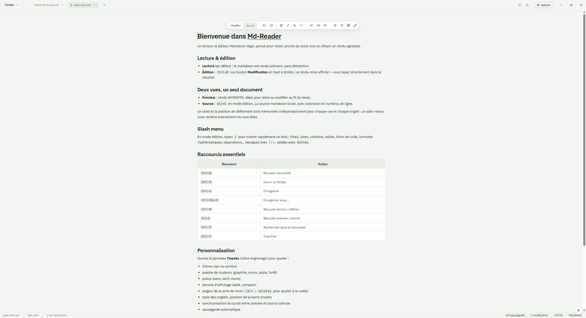

# Md-Reader

Un lecteur et éditeur Markdown léger pour Windows, pensé pour rester proche du texte tout en offrant un rendu agréable. Construit avec Tauri 2 et React.

<p align="center">
  <a href="https://github.com/Theo-Lempereur/Md-Reader/releases/latest">
    
  </a>
  <a href="https://github.com/Theo-Lempereur/Md-Reader/releases">
    
  </a>
  
  
  
</p>

<p align="center">
  
</p>

## Téléchargement

La version la plus récente est disponible sur la page des releases :

**[Télécharger Md-Reader pour Windows](https://github.com/Theo-Lempereur/Md-Reader/releases/latest)**

Téléchargez le fichier `Md-Reader_X.Y.Z_x64-setup.exe`, double-cliquez dessus et suivez l'installation.

> **Note** : au premier lancement, Windows SmartScreen peut afficher un avertissement « Windows a protégé votre PC » parce que l'application n'est pas encore signée avec un certificat de code commercial. Cliquez sur **Plus d'infos** puis **Exécuter quand même**. Cet avertissement disparaîtra automatiquement avec le temps grâce au système de réputation de SmartScreen.

Une fois installée, l'application se met à jour toute seule : un bouton apparaît dans le coin supérieur droit quand une nouvelle version est disponible.

## Fonctionnalités

- **Rendu live** du Markdown avec support GFM (tables, listes de tâches, etc.)
- **Mode lecture et mode édition** (`Ctrl+M` pour basculer)
- **Deux vues** : preview WYSIWYG ou source brute avec coloration syntaxique (`Alt+S`)
- **Slash menu** (`/` en mode édition) pour insérer rapidement titres, listes, tables, formules…
- **Support LaTeX** via KaTeX pour les formules mathématiques
- **Onglets multiples** avec gestion d'état persistante
- **Export PDF** natif (A4 ou Letter)
- **Personnalisation** : thèmes clair/sombre, palettes, polices, densité, largeur de texte
- **Association de fichiers** : ouvre directement les `.md` et `.markdown` depuis l'explorateur
- **Mises à jour automatiques** signées cryptographiquement

## Raccourcis principaux

| Raccourci | Action |
|-----------|--------|
| `Ctrl+N` | Nouveau document |
| `Ctrl+O` | Ouvrir un fichier |
| `Ctrl+S` | Enregistrer |
| `Ctrl+Maj+S` | Enregistrer sous… |
| `Ctrl+M` | Basculer lecture / édition |
| `Alt+S` | Basculer preview / source |
| `Ctrl+F` | Rechercher |
| `Ctrl+P` | Imprimer |

## Stack technique

- **[Tauri 2](https://tauri.app/)** — runtime desktop (Rust + WebView2)
- **[React 19](https://react.dev/)** + TypeScript pour l'UI
- **[Vite](https://vitejs.dev/)** pour le bundling
- **[react-markdown](https://github.com/remarkjs/react-markdown)** + **remark-gfm** pour le parsing
- **[KaTeX](https://katex.org/)** pour le rendu mathématique
- **[Turndown](https://github.com/mixmark-io/turndown)** pour la conversion HTML → Markdown

## Développement local

### Prérequis

- [Node.js 20+](https://nodejs.org/)
- [Rust stable](https://rustup.rs/)
- **Microsoft C++ Build Tools** (Visual Studio Build Tools avec la charge « Desktop development with C++ »)

### Lancer en dev

```bash
npm install
npm run tauri dev
```

### Build local

```bash
npm run tauri build
```

L'installer NSIS est généré dans `src-tauri/target/release/bundle/nsis/`.

## Licence

Projet personnel — tous droits réservés sauf indication contraire.
